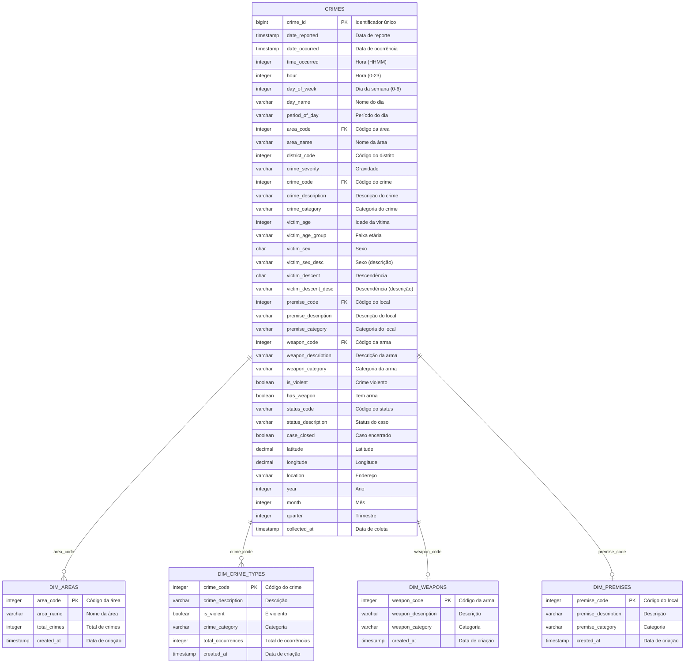

# Modelagem de Dados - Camada Silver
## Crime Data from 2020 to Present

---

## Índice

1. [MER - Modelo Entidade-Relacionamento](#mer---modelo-entidade-relacionamento)
2. [DER - Diagrama Entidade-Relacionamento](#der---diagrama-entidade-relacionamento)
3. [DLD - Data Layer Design](#dld---data-layer-design)
4. [Regras de Negócio](#regras-de-negócio)
5. [Índices e Performance](#índices-e-performance)
6. [Views Analíticas](#views-analíticas)

---

## MER - Modelo Entidade-Relacionamento

### Modelo Conceitual

A camada **Silver** implementa um modelo relacional normalizado para armazenar dados de crimes limpos e padronizados.

### Entidades Principais

#### 1. CRIMES (Entidade Principal)
```
CRIMES(
    crime_id,
    date_reported,
    date_occurred,
    time_occurred,
    hour,
    day_of_week,
    day_name,
    period_of_day,
    area_code,
    area_name,
    district_code,
    crime_severity,
    crime_code,
    crime_description,
    crime_category,
    victim_age,
    victim_age_group,
    victim_sex,
    victim_sex_desc,
    victim_descent,
    victim_descent_desc,
    premise_code,
    premise_description,
    premise_category,
    weapon_code,
    weapon_description,
    weapon_category,
    is_violent,
    has_weapon,
    status_code,
    status_description,
    case_closed,
    latitude,
    longitude,
    location,
    year,
    month,
    quarter,
    collected_at
)
```

**PK:** crime_id
**Descrição:** Tabela fato desnormalizada contendo todos os dados de crimes processados e enriquecidos.

#### 2. DIM_AREAS (Dimensão de Áreas)
```
DIM_AREAS(
    area_code,
    area_name,
    total_crimes,
    created_at
)
```

**PK:** area_code
**Descrição:** Catálogo de áreas geográficas da LAPD.

#### 3. DIM_CRIME_TYPES (Dimensão de Tipos de Crime)
```
DIM_CRIME_TYPES(
    crime_code,
    crime_description,
    is_violent,
    crime_category,
    total_occurrences,
    created_at
)
```

**PK:** crime_code
**Descrição:** Catálogo de tipos de crimes com classificações.

#### 4. DIM_WEAPONS (Dimensão de Armas)
```
DIM_WEAPONS(
    weapon_code,
    weapon_description,
    weapon_category,
    created_at
)
```

**PK:** weapon_code
**Descrição:** Catálogo de armas utilizadas em crimes.

#### 5. DIM_PREMISES (Dimensão de Locais)
```
DIM_PREMISES(
    premise_code,
    premise_description,
    premise_category,
    created_at
)
```

**PK:** premise_code
**Descrição:** Catálogo de tipos de locais onde crimes ocorrem.

### Relacionamentos

```
CRIMES ──> DIM_AREAS
    (area_code) references (area_code)
    Cardinalidade: N:1
    Descrição: Cada crime ocorre em uma área

CRIMES ──> DIM_CRIME_TYPES
    (crime_code) references (crime_code)
    Cardinalidade: N:1
    Descrição: Cada crime tem um tipo

CRIMES ──> DIM_WEAPONS
    (weapon_code) references (weapon_code)
    Cardinalidade: N:0..1
    Descrição: Cada crime pode ou não ter uma arma

CRIMES ──> DIM_PREMISES
    (premise_code) references (premise_code)
    Cardinalidade: N:0..1
    Descrição: Cada crime ocorre em um tipo de local
```

---

## DER - Diagrama Entidade-Relacionamento

### Diagrama Mermaid (Modelo Lógico)



### Diagrama Textual (Notação Chen)

```
┌─────────────────┐
│     CRIMES      │
│─────────────────│
│ • crime_id (PK) │
│   date_reported │
│   date_occurred │
│   ...           │
└────────┬────────┘
         │
         │ N
         │
    ┌────┴─────┐
    │          │
    │ 1        │ 1
    │          │
┌───▼───────┐  │  ┌──────────────┐
│ DIM_AREAS │  │  │DIM_CRIME_TYPES│
│───────────│  │  │───────────────│
│•area_code │  │  │• crime_code   │
│ area_name │  │  │  description  │
└───────────┘  │  └───────────────┘
               │
          ┌────┴────────┐
          │             │
          │ 0..1        │ 0..1
          │             │
    ┌─────▼──────┐  ┌──▼──────────┐
    │DIM_WEAPONS │  │DIM_PREMISES │
    │────────────│  │─────────────│
    │•weapon_code│  │•premise_code│
    │ description│  │ description │
    └────────────┘  └─────────────┘
```

---

## DLD - Data Layer Design

### Visão Geral

**Camada:** Silver (Dados Limpos e Padronizados)
**Tecnologia:** PostgreSQL
**Schema:** `silver`
**Objetivo:** Armazenar dados validados, limpos e enriquecidos para análises e geração da camada Gold.

### Tabelas Físicas

#### Tabela: silver.crimes

**Descrição:** Tabela principal contendo todos os registros de crimes processados.

| Coluna | Tipo de Dado | Tamanho | Nullable | Default | Descrição |
|--------|--------------|---------|----------|---------|-----------|
| `crime_id` | BIGINT | 8 bytes | NOT NULL | - | Identificador único do crime (PK) |
| `date_reported` | TIMESTAMP | 8 bytes | NOT NULL | - | Data em que o crime foi reportado |
| `date_occurred` | TIMESTAMP | 8 bytes | NOT NULL | - | Data em que o crime ocorreu |
| `time_occurred` | INTEGER | 4 bytes | NULL | - | Hora da ocorrência (formato HHMM) |
| `hour` | INTEGER | 4 bytes | NULL | - | Hora extraída (0-23) |
| `day_of_week` | INTEGER | 4 bytes | NULL | - | Dia da semana (0=Segunda, 6=Domingo) |
| `day_name` | VARCHAR(15) | var | NULL | - | Nome do dia da semana |
| `period_of_day` | VARCHAR(20) | var | NULL | - | Período: Morning/Afternoon/Evening/Night |
| `area_code` | INTEGER | 4 bytes | NOT NULL | - | Código da área LAPD |
| `area_name` | VARCHAR(50) | var | NULL | - | Nome da área LAPD |
| `district_code` | INTEGER | 4 bytes | NULL | - | Código do distrito |
| `crime_severity` | VARCHAR(20) | var | NULL | - | Gravidade: Serious/Minor |
| `crime_code` | INTEGER | 4 bytes | NOT NULL | - | Código do tipo de crime |
| `crime_description` | VARCHAR(255) | var | NULL | - | Descrição do crime |
| `crime_category` | VARCHAR(50) | var | NULL | - | Categoria: Violent/Property/Quality of Life/Other |
| `victim_age` | INTEGER | 4 bytes | NULL | - | Idade da vítima |
| `victim_age_group` | VARCHAR(20) | var | NULL | - | Faixa etária: 0-17/18-25/26-35/36-50/51-65/65+ |
| `victim_sex` | CHAR(1) | 1 byte | NULL | - | Sexo: M/F/X |
| `victim_sex_desc` | VARCHAR(20) | var | NULL | - | Descrição do sexo |
| `victim_descent` | CHAR(1) | 1 byte | NULL | - | Código de descendência |
| `victim_descent_desc` | VARCHAR(50) | var | NULL | - | Descrição da descendência |
| `premise_code` | INTEGER | 4 bytes | NULL | - | Código do tipo de local |
| `premise_description` | VARCHAR(255) | var | NULL | - | Descrição do local |
| `premise_category` | VARCHAR(50) | var | NULL | - | Categoria: Residential/Public/Commercial/Other |
| `weapon_code` | INTEGER | 4 bytes | NULL | - | Código da arma utilizada |
| `weapon_description` | VARCHAR(100) | var | NULL | - | Descrição da arma |
| `weapon_category` | VARCHAR(50) | var | NULL | - | Categoria: Firearm/Blade/Blunt Object/etc |
| `is_violent` | BOOLEAN | 1 byte | NULL | - | Flag indicando crime violento |
| `has_weapon` | BOOLEAN | 1 byte | NULL | - | Flag indicando uso de arma |
| `status_code` | VARCHAR(10) | var | NULL | - | Código do status do caso |
| `status_description` | VARCHAR(50) | var | NULL | - | Descrição do status |
| `case_closed` | BOOLEAN | 1 byte | NULL | - | Flag indicando caso encerrado |
| `latitude` | DECIMAL(10,6) | var | NULL | - | Coordenada de latitude |
| `longitude` | DECIMAL(10,6) | var | - | Coordenada de longitude |
| `location` | VARCHAR(255) | var | NULL | - | Endereço textual |
| `year` | INTEGER | 4 bytes | NULL | - | Ano da ocorrência |
| `month` | INTEGER | 4 bytes | NULL | - | Mês da ocorrência |
| `quarter` | INTEGER | 4 bytes | NULL | - | Trimestre da ocorrência |
| `collected_at` | TIMESTAMP | 8 bytes | NULL | - | Timestamp do processamento ETL |

**Constraints:**
- PRIMARY KEY: `crime_id`
- CHECK: `hour` BETWEEN 0 AND 23 (implícito)
- CHECK: `victim_age` BETWEEN 0 AND 120 (implícito)

**Tamanho Estimado:**
- Registros: ~38,000
- Tamanho médio por linha: ~500 bytes
- Tamanho total estimado: ~19 MB

---

#### Tabela: silver.dim_areas

**Descrição:** Dimensão de áreas geográficas da LAPD.

| Coluna | Tipo de Dado | Tamanho | Nullable | Default | Descrição |
|--------|--------------|---------|----------|---------|-----------|
| `area_code` | INTEGER | 4 bytes | NOT NULL | - | Código da área (PK) |
| `area_name` | VARCHAR(50) | var | NOT NULL | - | Nome da área |
| `total_crimes` | INTEGER | 4 bytes | NULL | 0 | Total de crimes na área |
| `created_at` | TIMESTAMP | 8 bytes | NULL | CURRENT_TIMESTAMP | Data de criação do registro |

**Constraints:**
- PRIMARY KEY: `area_code`

**Registros Estimados:** 21 áreas

---

#### Tabela: silver.dim_crime_types

**Descrição:** Dimensão de tipos de crimes.

| Coluna | Tipo de Dado | Tamanho | Nullable | Default | Descrição |
|--------|--------------|---------|----------|---------|-----------|
| `crime_code` | INTEGER | 4 bytes | NOT NULL | - | Código do crime (PK) |
| `crime_description` | VARCHAR(255) | var | NOT NULL | - | Descrição do crime |
| `is_violent` | BOOLEAN | 1 byte | NULL | FALSE | Flag de crime violento |
| `crime_category` | VARCHAR(50) | var | NULL | - | Categoria do crime |
| `total_occurrences` | INTEGER | 4 bytes | NULL | 0 | Total de ocorrências |
| `created_at` | TIMESTAMP | 8 bytes | NULL | CURRENT_TIMESTAMP | Data de criação |

**Constraints:**
- PRIMARY KEY: `crime_code`

**Registros Estimados:** ~111 tipos de crimes

---

#### Tabela: silver.dim_weapons

**Descrição:** Dimensão de armas utilizadas.

| Coluna | Tipo de Dado | Tamanho | Nullable | Default | Descrição |
|--------|--------------|---------|----------|---------|-----------|
| `weapon_code` | INTEGER | 4 bytes | NOT NULL | - | Código da arma (PK) |
| `weapon_description` | VARCHAR(100) | var | NOT NULL | - | Descrição da arma |
| `weapon_category` | VARCHAR(50) | var | NULL | - | Categoria da arma |
| `created_at` | TIMESTAMP | 8 bytes | NULL | CURRENT_TIMESTAMP | Data de criação |

**Constraints:**
- PRIMARY KEY: `weapon_code`

**Registros Estimados:** ~50 tipos de armas

---

#### Tabela: silver.dim_premises

**Descrição:** Dimensão de tipos de locais.

| Coluna | Tipo de Dado | Tamanho | Nullable | Default | Descrição |
|--------|--------------|---------|----------|---------|-----------|
| `premise_code` | INTEGER | 4 bytes | NOT NULL | - | Código do local (PK) |
| `premise_description` | VARCHAR(255) | var | NOT NULL | - | Descrição do local |
| `premise_category` | VARCHAR(50) | var | NULL | - | Categoria do local |
| `created_at` | TIMESTAMP | 8 bytes | NULL | CURRENT_TIMESTAMP | Data de criação |

**Constraints:**
- PRIMARY KEY: `premise_code`

**Registros Estimados:** ~100 tipos de locais

---

## Regras de Negócio

### Validações de Qualidade

1. **Identificação**
   - `crime_id` deve ser único e não nulo
   - `crime_id` corresponde ao DR_NO original

2. **Datas e Tempo**
   - `date_reported` >= `date_occurred`
   - `hour` deve estar entre 0 e 23
   - `time_occurred` no formato HHMM (0000-2359)
   - `year`, `month`, `quarter` derivados de `date_occurred`

3. **Localização**
   - `latitude` e `longitude` devem estar dentro dos limites de Los Angeles
   - Coordenadas (0, 0) são consideradas inválidas e removidas
   - `area_code` deve existir em `dim_areas`

4. **Crime**
   - `crime_code` deve existir em `dim_crime_types`
   - `crime_category` derivada da descrição do crime
   - `is_violent` calculado baseado em `crime_category`

5. **Vítima**
   - `victim_age` entre 0 e 120
   - `victim_sex` em {M, F, X}
   - `victim_age_group` derivado de `victim_age`

6. **Arma e Local**
   - `weapon_code` e `premise_code` podem ser nulos
   - `has_weapon` baseado na presença de `weapon_code`

### Campos Derivados/Calculados

- **Temporais:** `hour`, `day_of_week`, `day_name`, `period_of_day`, `year`, `month`, `quarter`
- **Categóricos:** `crime_category`, `crime_severity`, `premise_category`, `weapon_category`, `victim_age_group`
- **Flags:** `is_violent`, `has_weapon`, `case_closed`

---

## Índices e Performance

### Índices Criados

```sql
-- Índice em data de ocorrência (consultas temporais)
CREATE INDEX idx_crimes_date ON silver.crimes(date_occurred);

-- Índice em área (consultas por região)
CREATE INDEX idx_crimes_area ON silver.crimes(area_code);

-- Índice em tipo de crime (consultas por categoria)
CREATE INDEX idx_crimes_type ON silver.crimes(crime_code);

-- Índice espacial (consultas geográficas)
CREATE INDEX idx_crimes_location ON silver.crimes(latitude, longitude);

-- Índice em crimes violentos (filtros comuns)
CREATE INDEX idx_crimes_violent ON silver.crimes(is_violent);

-- Índice em hora (análises de padrões temporais)
CREATE INDEX idx_crimes_hour ON silver.crimes(hour);
```

### Estratégia de Indexação

- **B-Tree indexes:** Utilizados para consultas de igualdade e range
- **Composite index:** (latitude, longitude) para consultas espaciais
- **Selective indexes:** Em colunas frequentemente usadas em WHERE e JOIN

---

## Views Analíticas

### View: silver.vw_crimes_temporal

**Descrição:** Agregação temporal de crimes.

```sql
CREATE OR REPLACE VIEW silver.vw_crimes_temporal AS
SELECT
    year,
    month,
    day_of_week,
    day_name,
    period_of_day,
    (day_of_week IN (5, 6)) AS is_weekend,
    COUNT(*) as total_crimes,
    SUM(CASE WHEN is_violent THEN 1 ELSE 0 END) as violent_crimes,
    AVG(victim_age) as avg_victim_age
FROM silver.crimes
GROUP BY year, month, day_of_week, day_name, period_of_day;
```

**Uso:** Análises de tendências temporais, padrões sazonais.

---

### View: silver.vw_crimes_by_area

**Descrição:** Agregação por área geográfica.

```sql
CREATE OR REPLACE VIEW silver.vw_crimes_by_area AS
SELECT
    area_code,
    area_name,
    COUNT(*) as total_crimes,
    SUM(CASE WHEN is_violent THEN 1 ELSE 0 END) as violent_crimes,
    COUNT(DISTINCT crime_code) as unique_crime_types,
    AVG(victim_age) as avg_victim_age
FROM silver.crimes
GROUP BY area_code, area_name;
```

**Uso:** Comparação entre áreas, identificação de hotspots.

---

## Consultas de Exemplo

### 1. Crimes por mês e categoria

```sql
SELECT
    year,
    month,
    crime_category,
    COUNT(*) as total,
    AVG(victim_age) as avg_age
FROM silver.crimes
GROUP BY year, month, crime_category
ORDER BY year, month, total DESC;
```

### 2. Top 10 áreas mais perigosas

```sql
SELECT
    area_name,
    COUNT(*) as total_crimes,
    SUM(CASE WHEN is_violent THEN 1 ELSE 0 END) as violent_crimes,
    ROUND(100.0 * SUM(CASE WHEN is_violent THEN 1 ELSE 0 END) / COUNT(*), 2) as violent_rate
FROM silver.crimes
GROUP BY area_name
ORDER BY violent_crimes DESC
LIMIT 10;
```

### 3. Padrão horário de crimes

```sql
SELECT
    hour,
    period_of_day,
    COUNT(*) as total_crimes,
    SUM(CASE WHEN has_weapon THEN 1 ELSE 0 END) as crimes_with_weapon
FROM silver.crimes
GROUP BY hour, period_of_day
ORDER BY hour;
```

### 4. Perfil de vítimas

```sql
SELECT
    victim_age_group,
    victim_sex_desc,
    victim_descent_desc,
    COUNT(*) as total,
    AVG(CASE WHEN is_violent THEN 1.0 ELSE 0.0 END) as violent_rate
FROM silver.crimes
WHERE victim_age_group != 'Unknown'
GROUP BY victim_age_group, victim_sex_desc, victim_descent_desc
ORDER BY total DESC;
```

---

## Metadados e Qualidade

### Linhagem de Dados

```
Raw Layer (CSV)
    │
    ├─> Limpeza e Validação
    │   ├─ Remoção de duplicados
    │   ├─ Filtro de coordenadas inválidas
    │   ├─ Validação de idades
    │   └─ Normalização de datas
    │
    ├─> Transformações
    │   ├─ Derivação de campos temporais
    │   ├─ Categorização de crimes
    │   ├─ Classificação de vítimas
    │   └─ Enriquecimento de dados
    │
    └─> Silver Layer (PostgreSQL)
        ├─ silver.crimes (tabela principal)
        └─ silver.dim_* (dimensões)
```

### Estatísticas de Qualidade

- **Taxa de Limpeza:** ~76.8% dos registros mantidos
- **Registros Removidos:** ~23.2% (duplicados, dados inválidos, inconsistências)
- **Campos Nulos Aceitáveis:** weapon_code, premise_code, victim_age
- **Campos Obrigatórios:** crime_id, date_occurred, date_reported, area_code, crime_code

### Frequência de Atualização

- **ETL Batch:** Execução sob demanda
- **Incremental Load:** Não implementado (full refresh)
- **Retenção:** Dados desde 2020 até presente

---

## Notas Técnicas

### Tamanho e Performance

- **Tabela Principal:** ~38,000 registros, ~19 MB
- **Dimensões:** 4 tabelas, < 1 MB total
- **Índices:** 6 índices, ~5 MB total
- **Views:** 2 views materializadas sob demanda

### Manutenção

- **Vacuum:** Recomendado após grandes cargas
- **Analyze:** Executar após ETL para atualizar estatísticas
- **Reindex:** Se necessário após muitas atualizações

### Próximos Passos

1. Implementar tabelas de auditoria
2. Adicionar particionamento por ano
3. Criar materialized views para agregações pesadas
4. Implementar CDC (Change Data Capture) para incremental loads

---

**Versão:** 1.0
**Data:** 2026-01-26
**Autor:** ETL Pipeline - Silver Layer
**Status:** Produção
