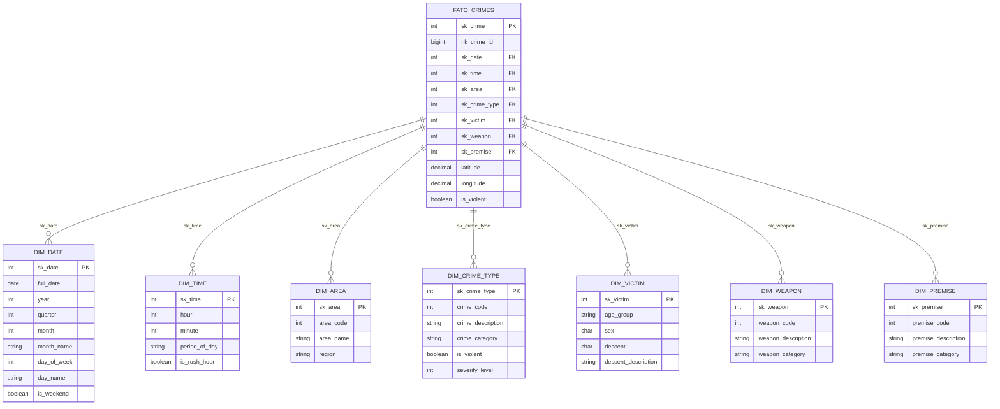

# Modelagem de Dados - MER/DER/DLD

## ME-R

DATA_SILVER(crime_id, date_reported, date_occurred, time_occurred, hour, day_of_week,
day_name, period_of_day, area_code, area_name, district_code, crime_severity,
crime_code, crime_description, crime_category, victim_age, victim_age_group,
victim_sex, victim_sex_desc, victim_descent, victim_descent_desc, premise_code,
premise_description, premise_category, weapon_code, weapon_description, weapon_category,
is_violent, has_weapon, status_code, status_description, case_closed, latitude,
longitude, location, year, month, quarter, collected_at)

## Modelo Conceitual

O modelo dimensional segue o padrão **Star Schema**, otimizado para consultas analíticas.

## Star Schema



## Descrição das Tabelas

### Tabela Fato

#### fato_crimes
Tabela central contendo os eventos de crimes.

| Coluna | Tipo | Descrição |
|--------|------|-----------|
| sk_crime | SERIAL | Surrogate Key (PK) |
| nk_crime_id | BIGINT | Natural Key (DR_NO) |
| sk_date | INTEGER | FK para dim_date |
| sk_time | INTEGER | FK para dim_time |
| sk_area | INTEGER | FK para dim_area |
| sk_crime_type | INTEGER | FK para dim_crime_type |
| sk_victim | INTEGER | FK para dim_victim |
| sk_weapon | INTEGER | FK para dim_weapon |
| sk_premise | INTEGER | FK para dim_premise |
| latitude | DECIMAL | Coordenada |
| longitude | DECIMAL | Coordenada |
| is_violent | BOOLEAN | Flag de crime violento |

### Tabelas Dimensão

#### dim_date
Calendário para análise temporal.

| Coluna | Tipo | Descrição |
|--------|------|-----------|
| sk_date | SERIAL | Surrogate Key (PK) |
| full_date | DATE | Data completa |
| year | INTEGER | Ano |
| quarter | INTEGER | Trimestre |
| month | INTEGER | Mês |
| month_name | VARCHAR | Nome do mês |
| week_of_year | INTEGER | Semana do ano |
| day_of_month | INTEGER | Dia do mês |
| day_of_week | INTEGER | Dia da semana |
| day_name | VARCHAR | Nome do dia |
| is_weekend | BOOLEAN | Fim de semana |

#### dim_time
Horas do dia para análise.

| Coluna | Tipo | Descrição |
|--------|------|-----------|
| sk_time | SERIAL | Surrogate Key (PK) |
| hour | INTEGER | Hora (0-23) |
| minute | INTEGER | Minuto |
| period_of_day | VARCHAR | Período (Manhã, Tarde, etc) |
| is_rush_hour | BOOLEAN | Horário de pico |

#### dim_area
Áreas geográficas da LAPD.

| Coluna | Tipo | Descrição |
|--------|------|-----------|
| sk_area | SERIAL | Surrogate Key (PK) |
| area_code | INTEGER | Código da área |
| area_name | VARCHAR | Nome da área |
| region | VARCHAR | Região (Central, Valley, etc) |

#### dim_crime_type
Tipos e categorias de crimes.

| Coluna | Tipo | Descrição |
|--------|------|-----------|
| sk_crime_type | SERIAL | Surrogate Key (PK) |
| crime_code | INTEGER | Código do crime |
| crime_description | VARCHAR | Descrição |
| crime_category | VARCHAR | Categoria |
| is_violent | BOOLEAN | Crime violento |
| severity_level | INTEGER | Nível de gravidade |

#### dim_victim
Perfil demográfico das vítimas.

| Coluna | Tipo | Descrição |
|--------|------|-----------|
| sk_victim | SERIAL | Surrogate Key (PK) |
| age_group | VARCHAR | Faixa etária |
| sex | CHAR | Sexo |
| descent | CHAR | Descendência (código) |
| descent_description | VARCHAR | Descendência (descrição) |

## Tabelas de Agregação

Para otimizar consultas frequentes:

| Tabela | Descrição |
|--------|-----------|
| `agg_crimes_area_period` | Crimes por área e período |
| `agg_crimes_type_year` | Crimes por tipo e ano |
| `agg_crime_hotspots` | Hotspots geográficos |

## Consultas Exemplo

### Total de crimes por área

```sql
SELECT 
    a.area_name,
    COUNT(*) as total_crimes,
    SUM(CASE WHEN f.is_violent THEN 1 ELSE 0 END) as violent_crimes
FROM gold.fato_crimes f
JOIN gold.dim_area a ON f.sk_area = a.sk_area
GROUP BY a.area_name
ORDER BY total_crimes DESC;
```

### Crimes por período do dia

```sql
SELECT 
    t.period_of_day,
    COUNT(*) as total_crimes
FROM gold.fato_crimes f
JOIN gold.dim_time t ON f.sk_time = t.sk_time
GROUP BY t.period_of_day
ORDER BY total_crimes DESC;
```

### Perfil de vítimas por tipo de crime

```sql
SELECT 
    ct.crime_category,
    v.age_group,
    v.sex,
    COUNT(*) as total
FROM gold.fato_crimes f
JOIN gold.dim_crime_type ct ON f.sk_crime_type = ct.sk_crime_type
JOIN gold.dim_victim v ON f.sk_victim = v.sk_victim
GROUP BY ct.crime_category, v.age_group, v.sex
ORDER BY total DESC;
```